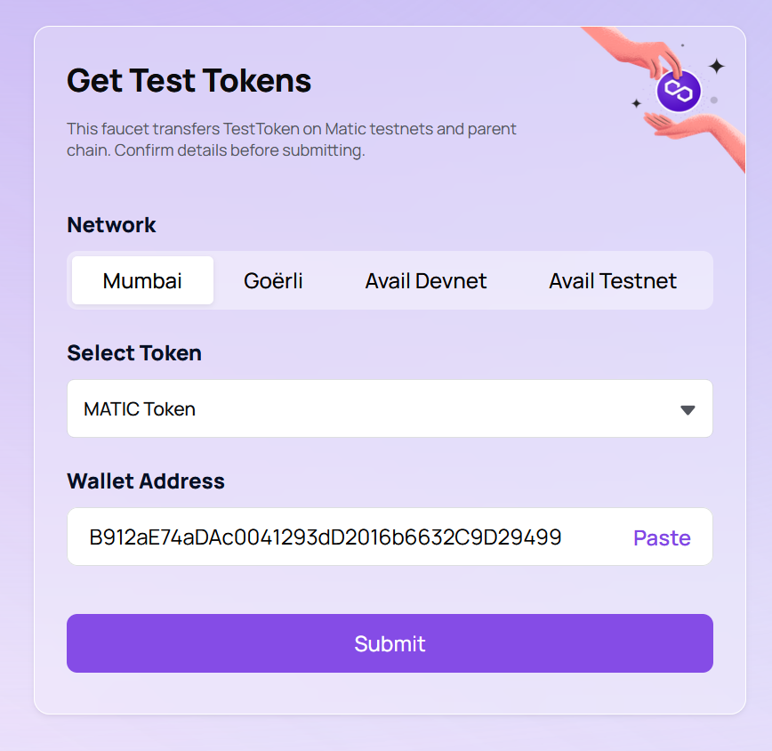

# Install

```
npm install
```

# Running the Demo app

```
npm run start
```

This will run the app on `http://localhost:8081/index`, where you can access the Swagger APIs.

# Create DID

Generate DID & Polygon wallet.


# Get Test Tokens

Get test token from [faucet.polygon](https://faucet.polygon.technology/) for the gas fee with the wallect address from the create did output.


# Register DID

After the Test Tokens transfer to wallect, DID could be published with the information according to the create did output.


# Update DID

DID document with mock vehicele informaiton could be attached on the published DID.


# Query result by polygonscan

The execution result is reflected on the [polygonscan](https://mumbai.polygonscan.com/)\
Filter with the wallect address from create did output.

